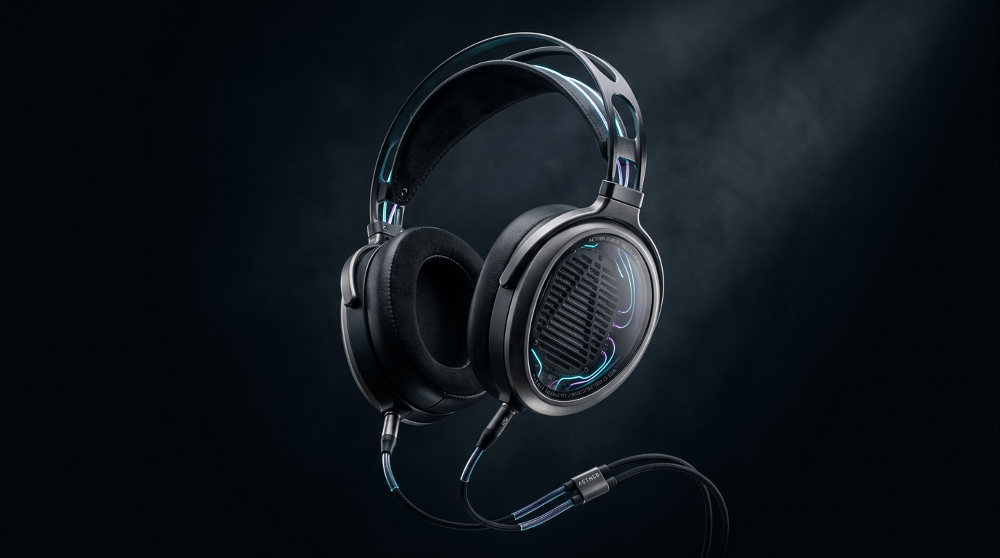

# Aurora Signal — Hyper-Dimensional Planar Audio & Acoustic Geometry



> **Theme Concept**: *"Dark Glass + Aurora Light"*  
> A high-performance, single-page business landing page crafted for **Aurora Signal** — a fictional ultra-luxury audio technology brand engineering planar-magnetic transducers, zero-latency wireless protocols, and quantum room calibration.

---

## 🌌 Key Design Language & Aesthetics

- **Near-Black Canvas**: Deep background palette (`#0A0B10` & `#06070A`) with fine noise & grid matrix textures.
- **Glassmorphism Panels**: Semi-transparent dark glass cards (`rgba(16, 20, 32, 0.55)`) with high-blur backdrop filters and luminous interior reflections.
- **Pure CSS Aurora Drift**: Floating, morphing aurora-gradient blobs drifting smoothly in the background (`#6EE7F9` Cyan → `#B388FF` Violet → `#FF7AC6` Pink → `#4EFA94` Emerald). Zero heavy external animation libraries.
- **Asymmetric & Editorial Typography**: Display headlines set in **Space Grotesk**, coupled with **Inter** body text and **JetBrains Mono** telemetry badges.
- **Custom Desktop Cursor**: Precision cyan dot with a lerping trailing blur ring that expands over interactive elements.
- **Scroll Reveal System**: Native ES6 `IntersectionObserver` fading and rising elements on scroll.
- **Accessibility & Performance**: Native `prefers-reduced-motion` support, keyboard focus outlines, semantic HTML5 structure.

---

## 🛠️ Tech Stack & Architecture

- **HTML5**: Semantic landmark architecture (`<header>`, `<nav>`, `<main>`, `<section>`, `<footer>`, `<dialog>` / toasts).
- **CSS3 & Tailwind CSS**: Utility base via CDN extended with custom theme tokens, `@keyframes`, glassmorphism utilities, and diagonal `clip-path` section dividers.
- **Vanilla JavaScript (ES6)**:
  - Sticky navigation with scroll opacity state.
  - Active section indicator via `IntersectionObserver`.
  - Custom CSS morphing hamburger button + full-screen glass mobile menu.
  - Custom drag-and-swipe touch carousel for testimonials.
  - Interactive pricing switch (Monthly vs Annual) with animated number counters.
  - Single-open FAQ accordion with dynamic `scrollHeight` animation.
  - Client-side contact form validation (regex email check) with toast feedback.
  - Interactive sound simulator / DSP flux visualizer.

---

## 📂 Project Structure

```text
/Landing Page
  ├── index.html               # Main landing page markup
  ├── css/
  │   └── style.css            # Aurora keyframes, glass panels, cursor, custom components
  ├── js/
  │   └── main.js              # Nav highlight, slider, accordion, form validation, cursor
  ├── assets/
  │   ├── images/
  │   │   ├── hero-product.jpg # Flagship planar headphone render
  │   │   ├── acoustic-core.jpg# Exploded transducer driver core
  │   │   ├── avatar-1.jpg     # Testimonial avatar (Marcus Vance)
  │   │   ├── avatar-2.jpg     # Testimonial avatar (Elena Rostova)
  │   │   └── avatar-3.jpg     # Testimonial avatar (David Chen)
  │   └── icons/
  ├── .gitignore               # Git ignore rules
  └── README.md                # Project documentation & deployment guides
```

---

## 🚀 Running Locally

Because Aurora Signal is built with pure static web standards (HTML5/CSS3/ES6), no build tool or compiler is required.

### Method 1: Python HTTP Server
```bash
# Python 3
python -m http.server 3000
```
Then visit `http://localhost:3000` in your browser.

### Method 2: Node.js `npx serve` or `live-server`
```bash
npx serve .
# or
npx live-server
```

### Method 3: VS Code / IDE Live Server
Right-click `index.html` and click **"Open with Live Server"**.

---

## 🚢 Deploying to Production

### 1. Deploying to Netlify (Drag & Drop or Git)
- **Option A (CLI)**:
  ```bash
  npm install -g netlify-cli
  netlify deploy --prod --dir=.
  ```
- **Option B (Web Dashboard)**:
  1. Go to [netlify.com](https://www.netlify.com/) and log in.
  2. Drag and drop the root folder into the Netlify "Sites" tab.
  3. Your site is instantly live with global CDN & HTTPS.

### 2. Deploying to Vercel
- **Option A (CLI)**:
  ```bash
  npm install -g vercel
  vercel --prod
  ```
- **Option B (GitHub Integration)**:
  1. Push this repository to GitHub.
  2. Import the repo in the [Vercel Dashboard](https://vercel.com).
  3. Keep default settings (Framework Preset: **Other**) and click **Deploy**.

---

## 🧪 Testing & Verification Matrix

| Device / Viewport | Resolution | Tested Features |
| :--- | :--- | :--- |
| **Desktop (Ultra-wide)** | 1440px - 1920px | Staggered grid, trailing custom cursor, dual-column contact & map, multi-column footer |
| **Tablet (iPad / Air)** | 768px - 1024px | 2-column testimonial cards, responsive pricing table, navbar collapsing |
| **Mobile (iPhone SE / 14)** | 375px - 430px | CSS morphing hamburger menu, full-screen glass overlay, touch swipe carousel, single column flow |

---

## 📄 License & Credits
Built for **Aurora Signal Acoustic Labs**.  
Concept & Design System: *Dark Glass + Aurora Light*.
